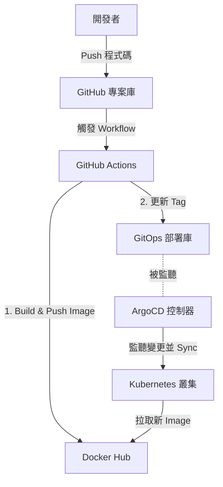

# Demo-Golang

> 一個基於 Go 語言的簡單 HTTP 網頁伺服器，專為展示 ArgoCD 部署、GitOps 自動化流程與 Docker 容器化打包而設計。

## 概述

本專案主要用於示範在 Kubernetes 環境下，透過 ArgoCD 實現 GitOps 持續部署的完整流程。應用程式運作時會以網頁呈現目前的應用程式版本、Pod 名稱、背景顏色以及同步時間，並提供 `/health` 端點供 Kubernetes 進行存活與就緒探針檢查。

## 架構

本專案整合了 GitHub Actions 作為 CI 工具，並透過 GitOps 機制與 ArgoCD 協作完成 CD 部署。其高階部署架構如下圖所示：



## 專案結構

```
.
├── .github/
│   └── workflows/
│       └── docker-publish.yml  # GitHub Actions 手動觸發 CI/CD 腳本
├── Dockerfile                  # 多階段建置 Docker 映像檔設定
├── go.mod                      # Go 模組定義 (Go 1.25.5)
├── main.go                     # HTTP 伺服器主程式與路由設定
└── README.md                   # 專案說明文件
```

## 快速開始

### 前置需求
- Go 1.25.5+

### 本機執行
```bash
go run main.go
```

### 組態設定
| 設定項 | 說明 | 預設值 |
|--------|------|--------|
| `APP_VERSION` | 網頁上顯示的應用程式版本 | `v1` |
| `BG_COLOR` | 網頁背景顏色 | `white` |
| `HOSTNAME` | 運作此服務的 Pod 名稱 (本機執行通常對應電腦主機名) | `LocalHost` |

## 核心元件

- [main.go](./main.go): 負責設定與啟動 HTTP 伺服器，定義首頁 `/` 以及健康檢查路由 `/health`。
- [Dockerfile](./Dockerfile): 採用多階段編譯 (Multi-stage build)，首先在 `golang:1.25-alpine` 環境中進行編譯，再將編譯好的二進位檔複製到極簡的 `alpine:latest` 映像檔中，確保最終映像檔體積最小化。
- [.github/workflows/docker-publish.yml](./.github/workflows/docker-publish.yml): GitHub Actions 工作流。支援手動觸發（`workflow_dispatch`），負責將 Docker 映像檔編譯並推送至 Docker Hub，接著自動以 SSH 金鑰修改 ArgoCD 的 Deployment 檔案，觸發 GitOps 自動部署。

## 運作流程

1. 客戶端發送 HTTP 請求至 `/`。
2. 伺服器讀取 `APP_VERSION`、`BG_COLOR` 與 `HOSTNAME` 環境變數。
3. 伺服器獲取目前系統時間，並渲染 HTML 內容返回給瀏覽器。
4. ArgoCD / Kubernetes 透過定期請求 `/health` 來偵測應用的存活狀態。

## 設計決策

- **極簡網頁呈現**: 採用內嵌 HTML 樣式，避免引入外部靜態檔案或前端框架，使範例聚焦在 CI/CD 與 K8s 部署流程。
- **多階段 Docker 建置**: 隔離編譯環境與執行環境，減少 Docker 映像檔的安全漏洞與體積。
- **GitOps 推送觸發**: 在 CI 流程最後，自動將短 SHA 標籤寫回 Kubernetes 設定檔 Repo 並推送，實現宣告式的版本更新。
