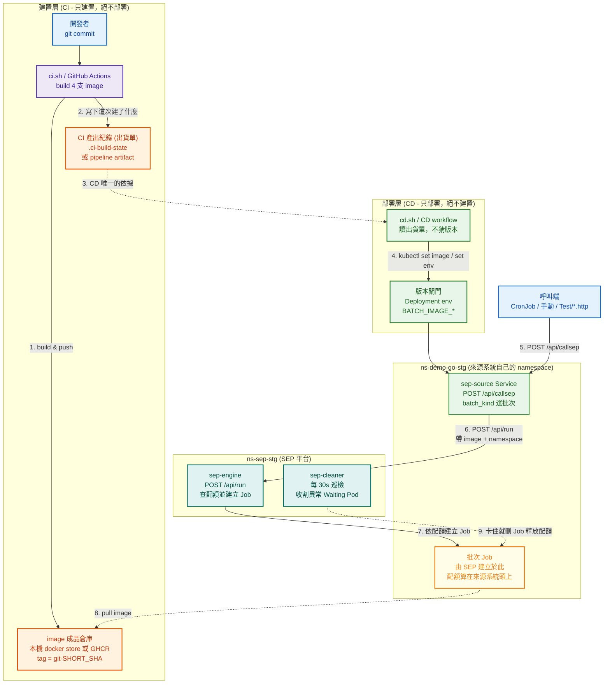

# Demo-Golang

> SEP（Serverless Execution Platform）的**來源系統（Source System）**示範專案。
> 對外提供 `/api/callsep`，由呼叫端指定要跑哪一支批次，再轉呼叫 SEP 的 `/api/run` 建立 Kubernetes Job。
> 同時作為 CI / CD 職責分離策略的實作範例——**CD 不會自己猜要部署哪一版**。

---

## 相關專案

| 專案 | 說明 |
| :--- | :--- |
| [SEP - Serverless Execution Platform](https://github.com/JeffLin0225/Kubernetes-Serverless) | 本專案呼叫的批次執行平台。負責接受 `/api/run` 請求、查詢配額、建立 K8s Job，並由 `sep-cleaner` 自動收割異常 Pod |

demo-go 是 SEP「來源系統接入規範（Source System Integration Spec）」的實作範例——
SEP 完全信任來源端傳入的 `image` 欄位，因此**版本安全閘門的責任在來源端**，
也就是本專案 CI/CD 策略章節所描述的角色③。

---

## 系統架構

demo-go 自己**不建立也不操作 Kubernetes Job**，那是 SEP Engine 的職責。它只負責決定「要跑哪一支 batch image」並發出請求，職責分離是刻意守住的邊界。


```mermaid
flowchart TD
    classDef devStyle fill:#E3F2FD,stroke:#1565C0,stroke-width:2px,color:#0D47A1
    classDef ciStyle fill:#EDE7F6,stroke:#512DA8,stroke-width:2px,color:#311B92
    classDef recordStyle fill:#FFF3E0,stroke:#E65100,stroke-width:2px,color:#BF360C
    classDef srcStyle fill:#E8F5E9,stroke:#2E7D32,stroke-width:2px,color:#1B5E20
    classDef sepStyle fill:#E0F2F1,stroke:#00695C,stroke-width:2px,color:#004D40
    classDef jobStyle fill:#FFFDE7,stroke:#F57F17,stroke-width:2px,color:#F57F17

    subgraph BuildLayer ["建置層 (CI - 只建置，絕不部署)"]
        Dev["開發者<br/>git commit"]
        CI["ci.sh / GitHub Actions<br/>build 4 支 image"]
        Images["image 成品倉庫<br/>本機 docker store 或 GHCR<br/>tag = git-SHORT_SHA"]
        Record["CI 產出紀錄 (出貨單)<br/>.ci-build-state<br/>或 pipeline artifact"]
    end

    subgraph DeployLayer ["部署層 (CD - 只部署，絕不建置)"]
        CD["cd.sh / CD workflow<br/>讀出貨單，不猜版本"]
        Gate["版本閘門<br/>Deployment env<br/>BATCH_IMAGE_*"]
    end

    subgraph SourceNS ["ns-demo-go-stg (來源系統自己的 namespace)"]
        Svc["sep-source Service<br/>POST /api/callsep<br/>batch_kind 選批次"]
        Job["批次 Job<br/>由 SEP 建立於此<br/>配額算在來源系統頭上"]
    end

    subgraph SepNS ["ns-sep-stg (SEP 平台)"]
        Engine["sep-engine<br/>POST /api/run<br/>查配額並建立 Job"]
        Cleaner["sep-cleaner<br/>每 30s 巡檢<br/>收割異常 Waiting Pod"]
    end

    Caller["呼叫端<br/>CronJob / 手動 / Test/*.http"]

    Dev --> CI
    CI -->|1. build & push| Images
    CI -->|2. 寫下這次建了什麼| Record
    Record -.->|3. CD 唯一的依據| CD
    CD -->|4. kubectl set image / set env| Gate
    Gate --> Svc

    Caller -->|5. POST /api/callsep| Svc
    Svc -->|6. POST /api/run<br/>帶 image + namespace| Engine
    Engine -->|7. 依配額建立 Job| Job
    Job -.->|8. pull image| Images
    Cleaner -.->|9. 卡住就刪 Job 釋放配額| Job

    class Dev,Caller devStyle
    class CI ciStyle
    class Images,Record recordStyle
    class CD,Gate,Svc srcStyle
    class Engine,Cleaner sepStyle
    class Job jobStyle
```

---

## CI / CD 策略（本專案的核心設計）

### 三個角色，不能混在一起

| # | 角色 | 存什麼 | 誰寫 | 誰讀 |
| :--- | :--- | :--- | :--- | :--- |
| ① | **成品倉庫** | image 本體 | CI push | k8s pull |
| ② | **CI 產出紀錄**（出貨單） | 「這次建出了哪一版」 | CI | **只有 CD** |
| ③ | **CD 版本閘門** | 「線上實際跑哪一版」 | **只有 CD** | runtime（Service） |

用倉儲比喻：**倉庫存貨、出貨單指定出哪一箱、閘門是貨架上現在擺著的那箱。倉庫裡有貨 ≠ 那箱貨該出。**

**②和③必須分開**，否則會出現「CD 還沒跑，批次卻已經跑到沒驗證過的新版」。所以：

- ②放在**叢集外**（本機檔案 / pipeline artifact），runtime 碰不到——不是靠紀律，是結構上讀不到
- ③是 Deployment 的 env，只有 `cd.sh` 的 `kubectl set env` 會寫

這也是為什麼 CI 階段**不該持有叢集憑證**：真實環境裡 CI 只給 registry push 權限，叢集憑證只給 CD。

### CD 絕不自己猜版本

`cd.sh` 不帶參數時，只讀 `.ci-build-state`，**不查 docker image 的 `CreatedAt`、不排序 tag、不推導 image 名稱**。

> **「該上線哪一版」是一個被做出來的決定，不是一個能從倉庫狀態推論出來的事實。**

這條規則來自實際踩過的坑：舊版 `cd.sh` 用 `docker images --format '{{.CreatedAt}}'` 排序找「最新建置」，但 Docker build cache 會沿用內容相同的舊 layer（連 `CreatedAt` 都繼承），導致多個 tag 時間戳一模一樣，排序退化成比較 tag 字串字母順序，選到的是 `git-b00ef34` 而不是真正的 HEAD。

紀錄裡存的是**完整 image refs** 而不只是 tag，因為 `REGISTRY_PREFIX` 可被環境變數覆蓋（CI 用 `ghcr.io/...` 建、CD 沒帶同一個變數就會拼出不存在的 `local/...`）。CI 寫什麼就部署什麼，中間不做任何推導。

```
# .ci-build-state（由 ci.sh 產生，已列入 .gitignore）
BUILD_TAG=git-ea1e8e4
BUILD_COMMIT=ea1e8e4d98626bcd7aac83fa3f3c10db907ca995
BUILD_TIME=2026-10-03T02:28:47+08:00
SERVICE_IMAGE=sep-source:git-ea1e8e4
BATCH_IMAGE_EMAILBATCH=local/emailbatch:git-ea1e8e4
BATCH_IMAGE_LINEBATCH=local/linebatch:git-ea1e8e4
BATCH_IMAGE_ERRORBATCH=local/errorbatch:git-ea1e8e4
```

### 對應到 GitHub Actions

本機的 `.ci-build-state` 對應的就是 **pipeline artifact**——掛在那次 workflow run 底下，跟 console log、測試報告是兄弟關係（**不是**跟 image 放一起；image 在 registry，artifact 只放幾百 bytes 的指針）。兩邊靠 **run ID** 關聯。

```yaml
# ---- CI workflow：只 build + 產出貨單，絕不部署 ----
- run: ./scripts/ci.sh
- uses: actions/upload-artifact@v4
  with:
    name: build-state
    path: .ci-build-state

# ---- CD workflow（另一條）：領出貨單 + 寫版本閘門 ----
- uses: actions/download-artifact@v4
  with:
    name: build-state
    run-id: ${{ github.event.workflow_run.id }}   # 指定要領哪次 CI 的
    github-token: ${{ secrets.GITHUB_TOKEN }}
- run: ./scripts/cd.sh
```

分工：**CI 寫上傳、CD 寫下載**。CD 永遠不會去寫出貨單——它寫的是版本閘門。

> 若只需傳一個 tag 字串，用 job `outputs`（`needs.build.outputs.tag`）比檔案更輕。
> 本專案的紀錄有 7 個欄位（含 4 個完整 image refs），用檔案更清楚。
>
> **注意**：pipeline artifact 會過期（GitHub 預設 90 天）。若需要長期追溯與回滾，
> 正式環境通常改走 GitOps——把 tag commit 進 manifest repo，git 歷史不會過期，回滾就是 `git revert`。

### 現有 workflow

| 檔案 | 用途 |
| :--- | :--- |
| `.github/workflows/build-batch.yml` | CI only：三支 batch image 推上 GHCR，只推 immutable tag，刻意不推 `:latest` |

---

## 專案結構

```
.
├── .github/workflows/
│   └── build-batch.yml       # CI only：batch image 建置並推送 GHCR（immutable tag）
├── Batch/                    # 被 SEP Job 執行的批次 workload（各自獨立 image）
│   ├── EmailBatch/           # 正常完成的批次
│   ├── LineBatch/            # 正常完成的批次
│   └── ErrorBatch/           # 故意失敗（log.Fatalf），用來測 Job 失敗行為
├── service/
│   ├── main.go               # 來源系統 HTTP Service：/api/callsep → SEP /api/run
│   └── Dockerfile
├── scripts/
│   ├── common.sh             # 共用設定 + CI 產出紀錄的讀寫（策略核心）
│   ├── ci.sh                 # 只建置，不部署；成功後寫出貨單
│   ├── cd.sh                 # 只部署，依出貨單；不猜版本
│   └── status.sh             # 比對「已建置」/「出貨單」/「叢集實際運行」三者
├── k8s/
│   ├── namespace.yaml        # ns-demo-go-stg（與 SEP 的 ns-sep-stg 隔開）
│   └── deployment.yaml       # 僅供第一次建立；之後由 cd.sh 更新線上版本
├── Test/
│   ├── api.http              # 需 port-forward 的測試
│   └── api.cluster-direct.http  # 走叢集 DNS，不用 port-forward
└── README.md
```

---

## 本機操作

### 前置

- Go 1.25.5+、Docker、kubectl
- 本機 Kubernetes（OrbStack；未啟用時執行 `orb start k8s`）
- 第一次部署前先建立資源：`kubectl apply -f k8s/`
- SEP 端須在 `sep-system-quotas` ConfigMap 註冊 `demo-go` 的 4 個配額 key，否則 `/api/run` 會回 500

### 流程

```bash
# 1. CI：建置 4 支 image（tag 一律由 git HEAD 推導，不接受參數）
./scripts/ci.sh
#    跑完叢集完全不受影響，此刻觸發批次仍然跑舊版——這是刻意的

# 2. 查看三者差異：已建置 / 出貨單 / 叢集實際運行
./scripts/status.sh

# 3. CD：部署出貨單裡的那一版
./scripts/cd.sh
#    要刻意部署舊版（新舊比較）才帶參數：./scripts/cd.sh git-020b6fd
```

`imagePullPolicy` 為 `Never`——OrbStack 的 k8s node 與 Mac 的 docker daemon 共用 image store，直接吃本機 image，不需要架 registry。image 不存在時會明確噴 `ErrImageNeverPull`，不會悄悄跑去遠端拉。`cd.sh` 在部署前會先 `docker image inspect` 擋掉這種情況。

---

## API 規格

| 方法 | 路徑 | 狀態碼 | 說明 |
| :--- | :--- | :--- | :--- |
| `POST` | `/api/callsep` | `200` | 轉呼叫 SEP `/api/run` 建立 Job，回傳 SEP 給的 `job_name` |
| | | `400` | `batch_kind` 缺少或不在合法清單內（回應會帶 `allowed` 清單） |
| | | `502` | SEP 端錯誤（最常見原因：`system_id` 未在配額表註冊） |

`batch_kind` **沒有預設值**，不帶就是呼叫端的錯。Service 不會幫忙猜要跑哪一支，只能從 `emailbatch` / `linebatch` / `errorbatch` 三個裡面選。

```bash
curl -X POST "http://sep-source-svc.ns-demo-go-stg.svc.cluster.local:8080/api/callsep" \
  -H "Content-Type: application/json" \
  -d '{"batch_kind": "emailbatch"}'
```

---

## 環境變數

| 變數名稱 | 說明 | 預設值 |
| :--- | :--- | :--- |
| `PORT` | Service 監聽 port | `8080` |
| `SEP_ENDPOINT` | SEP 的 `/api/run` 位址 | `http://sep-engine-svc.ns-sep-stg.svc.cluster.local:8080/api/run` |
| `SYSTEM_ID` | 送給 SEP 的來源系統識別（須已註冊配額，≤40 字元） | `demo-go` |
| `JOB_NAMESPACE` | Job 要建在哪個 namespace；留空則落在 SEP 自己的 namespace | `ns-demo-go-stg` |
| `BATCH_IMAGE_EMAILBATCH` | ← **版本閘門**，只由 `cd.sh` 寫入 | （無，缺少時回 400） |
| `BATCH_IMAGE_LINEBATCH` | ← **版本閘門** | （同上） |
| `BATCH_IMAGE_ERRORBATCH` | ← **版本閘門** | （同上） |

> 這三個 `BATCH_IMAGE_*` 就是上面策略裡的角色③。Service 在**啟動時**讀進記憶體，
> 所以改了要等 rollout 才生效——這也是「CI 不可能影響 runtime」的其中一層保障。

本機用 IDE 直接跑 `service/main.go` 時改讀 `.env`（godotenv 讀的是**執行時的工作目錄**，不是原始碼目錄）。
注意 OrbStack 會常駐佔用 `127.0.0.1:8080`，本機開發請用 `PORT=8081` 避開。

---

## 測試

`Test/` 底下兩份 `.http` 可在 GoLand / IDEA 直接點綠色箭頭執行：

| 檔案 | 需要 port-forward | 說明 |
| :--- | :--- | :--- |
| `Test/api.http` | 要 | 透過 `localhost` 打，含 IDE 本機跑 Service 的情境 |
| `Test/api.cluster-direct.http` | 不用 | 走 `*.svc.cluster.local` 叢集 DNS（OrbStack 已打通 host ↔ cluster 網路） |

### 測案 5：SEP Cleaner 收割異常 Waiting Pod

兩份檔案的第 5 項用來驗證 `sep-cleaner` 能抓到卡住的 Pod 並自動收割。原理是利用 `IMAGE_PULL_POLICY=Never`：送一個節點上不存在的 image，Pod 100% 會卡在 `ErrImageNeverPull`，而這個 reason 不在 cleaner 的白名單 `NORMAL_WAITING_REASONS=ContainerCreating,PodInitializing` 內，必定被判定異常。

```bash
curl -X POST "http://sep-engine-svc.ns-sep-stg.svc.cluster.local:8080/api/run" \
  -H "Content-Type: application/json" \
  -d '{
    "system_id": "demo-go",
    "task_id": "cleaner-waiting-test-001",
    "namespace": "ns-demo-go-stg",
    "image": "local/does-not-exist:cleaner-test"
  }'

# 一個巡檢週期（30s）內，cleaner log 應出現 ALERT 告警接著 CLEAN 收割
kubectl logs -n ns-sep-stg -l app=sep-cleaner -f

# 確認 Job 與 Pod 已被刪除（配額已釋放）
kubectl get job,pod -n ns-demo-go-stg -l task_id=cleaner-waiting-test-001
```

### 已驗證的行為

| 驗證項目 | 結果 |
| :--- | :--- |
| CI 跑完、CD 未跑時觸發批次 | 跑**舊版** `git-020b6fd`——CI 的產出紀錄沒有洩漏到 runtime |
| CD 跑完後觸發批次 | 跑**新版** `git-ea1e8e4`——版本閘門正確翻轉 |
| 沒有產出紀錄時 `cd.sh` 不帶參數 | 明確報錯並中止，**不猜版本** |
| Cleaner 收割異常 Pod | `ErrImageNeverPull` → 告警 → 刪除 Job，殘留為 0 |

---

## 常用維運指令

```bash
# 三者對照：已建置 / 出貨單 / 叢集實際運行
./scripts/status.sh

# 叢集目前實際跑的版本（版本閘門的真實值）
kubectl get deployment sep-source -n ns-demo-go-stg \
  -o jsonpath='{.spec.template.spec.containers[0].image}'

# 批次 Job 與它們實際使用的 image
kubectl get job -n ns-demo-go-stg --sort-by=.metadata.creationTimestamp \
  -o custom-columns='JOB:.metadata.name,IMAGE:.spec.template.spec.containers[0].image'

# Service 日誌
kubectl logs -f -l app=sep-source -n ns-demo-go-stg --tail=100

# SEP 端（Engine 與 Cleaner）
kubectl logs -n ns-sep-stg -l app=sep-engine --tail=50
kubectl logs -n ns-sep-stg -l app=sep-cleaner --tail=20

# SEP 的配額註冊表（demo-go 須有 4 個 key）
kubectl get configmap sep-system-quotas -n ns-sep-stg -o jsonpath='{.data}'
```

---

